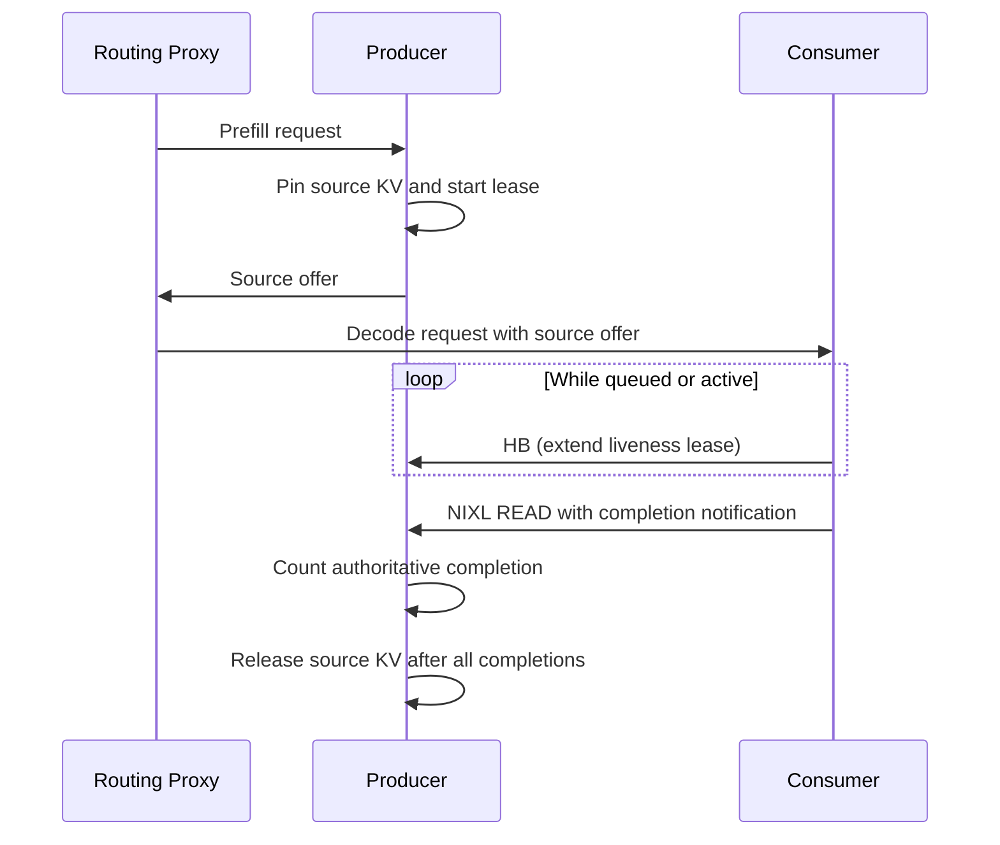

# NIXL KV Cache Lease and READ Ownership

In a disaggregated prefill/decode deployment, the producer keeps each completed
request's KV blocks pinned while a consumer may read them through NIXL. The
consumer initiates a READ and owns its native transfer handle. The producer
therefore cannot infer remote transfer quiescence from elapsed time.

The connector separates two concepts:

- A **lease** is a liveness signal. Heartbeats keep a source offer available
  while its consumer is queued or working.
- A **completion notification** is a quiescence proof. It is emitted by the
  NIXL transfer only after the remote READ completed and is the authority that
  allows the producer to release its source blocks.

## Ownership invariant

Producer blocks remain pinned until every expected consumer completion has
arrived. A lease deadline never authorizes source reuse.

This matters because the producer normally has no NIXL metadata for the decode
agents. The decode workers load the producer's metadata to initiate READs, but
that one-way handshake does not give the producer a channel that can revoke a
READ or wait for a revocation acknowledgement. A fixed grace period would only
guess at native quiescence and could expose reallocated KV pages to an older
in-flight READ.

## Lifecycle

1. The producer finishes a request, pins its KV blocks, and starts its liveness
   lease.
2. The consumer tracks the request as soon as it enters the scheduler. Batched
   `HB:` notifications extend the producer lease while the request is waiting
   or active.
3. Each successful READ carries a completion notification. The producer counts
   completions across tensor-parallel ranks and sibling consumers.
4. Once all expected completions arrive, the producer reports the request as
   finished sending and the scheduler releases its blocks.
5. If the liveness lease expires first, the producer records the expiration but
   retains ownership. A later authoritative completion still releases the
   blocks normally.



If the consumer disappears, the producer deliberately retains the unresolved
source allocation. Reclaiming it safely requires connection-level revocation
and acknowledgement or connector teardown that invalidates the NIXL
registration. Silently reusing it after a timeout would trade an availability
problem for data corruption.

## Heartbeat path

The scheduler starts heartbeat tracking in `on_new_request()`, before a request
is selected for execution. Requests are grouped by producer engine so one
notification renews multiple source leases. `build_connector_meta()` emits
heartbeat metadata at `kv_lease_duration // 6`, and the worker sends it through
the existing NIXL notification path.

The producer handles `HB:` messages before checking lease deadlines in
`get_finished()`. `_handle_heartbeat()` extends each live deadline with
`max(current_deadline, now + lease_extension)`, so a delayed heartbeat cannot
shorten a lease.

Handshake initiation is asynchronous. Heartbeat metadata can trigger the same
producer handshake that the eventual READ uses, which keeps scheduler steps
non-blocking and removes connection setup from most transfer-critical paths.

## Heterogeneous tensor parallelism

When producer TP is larger than consumer TP, one consumer rank reads from
multiple producer ranks and heartbeats every corresponding producer agent. When
consumer TP is larger, several consumer ranks may heartbeat and read one
producer rank. Producer completion accounting combines TP fan-out with
`expected_consumers`, so source release occurs only after the complete read set
is quiescent.

## Configuration

The lease settings live in `kv_connector_extra_config`:

| Parameter | Default | Description |
|-----------|---------|-------------|
| `kv_lease_duration` | 30s | Initial producer liveness lease. The heartbeat interval is one sixth of this value and each heartbeat extends the deadline by two thirds. Expiration records lost liveness but does not authorize READ-source reuse. |
| `decoder_kv_blocks_ttl` | 480s | Liveness lease for decoder-owned source blocks used by bidirectional transfer. Source reuse still requires transfer completion. |

```bash
vllm serve <MODEL> \
  --kv-transfer-config '{
    "kv_connector": "NixlConnector",
    "kv_role": "kv_producer",
    "kv_connector_extra_config": {"kv_lease_duration": 60}
  }'
```

For connector configuration, see the
[NixlConnector usage guide](../features/nixl_connector_usage.md).
