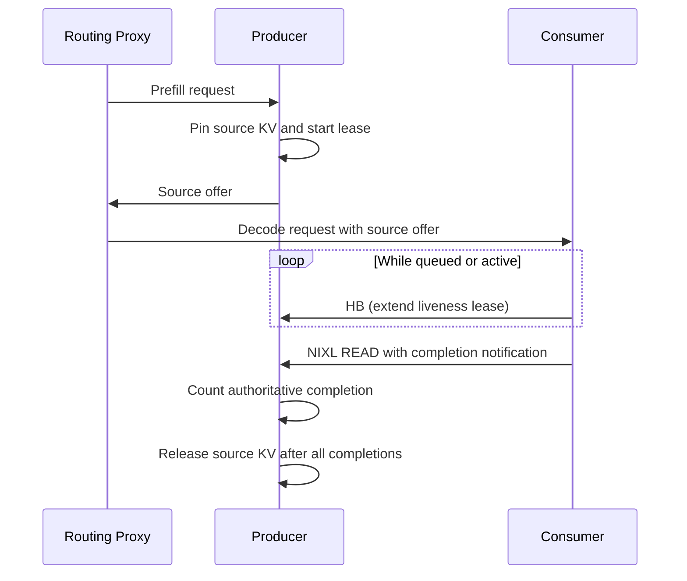

# NIXL KV Cache Lease and Native Ownership

In a disaggregated prefill/decode deployment, the producer keeps each completed
request's KV blocks pinned while NIXL may access them. Pull mode gives the READ
handle to the consumer. Push mode gives the WRITE handle to the producer. The
side that does not own a handle cannot infer its quiescence from elapsed time.

The connector separates two concepts:

- A **lease** is a liveness signal. Heartbeats keep a source offer available
  while its consumer is queued or working.
- A native **DONE** observation is a quiescence proof for the handle owner.
  Pull mode carries that proof to the producer in the READ completion
  notification. Push mode observes it locally on the producer.

## Ownership invariant

Memory can be reused only after every operation that may touch it is either
proven never posted or observed in native `DONE` state and released. A lease
deadline, `ERR`, an exception, and an attempted handle cancellation are not
quiescence proofs.

This matters because the producer normally has no NIXL metadata for the decode
agents. The decode workers load the producer's metadata to initiate READs, but
that one-way handshake does not give the producer a channel that can revoke a
READ or wait for a revocation acknowledgement. A fixed grace period would only
guess at native quiescence and could expose reallocated KV pages to an older
in-flight READ.

## Pull lifecycle

1. The producer finishes a request, pins its KV blocks, and starts its liveness
   lease.
2. The consumer tracks the request as soon as it enters the scheduler. Batched
   `HB:` notifications extend the producer lease while the request is waiting
   or active.
3. Each successful READ carries a completion notification. The producer counts
   completions across tensor-parallel ranks and sibling consumers.
4. Once all expected completions arrive, the producer reports the request as
   finished sending and the scheduler releases its blocks.
5. If the liveness lease expires first, the producer raises
   `TransferQuiescenceError` without releasing the source. The engine process
   terminates so transport and registered-memory teardown provide the terminal
   ownership boundary.



The producer cannot safely recover a vanished pull consumer in-process because
it has neither the remote READ handle nor a revocation acknowledgement channel.
Process fail-stop is intentional. Silently reusing the allocation would trade
an availability failure for data corruption, while retaining it indefinitely
would exhaust KV capacity and keep the scheduler polling.

## Push lifecycle

The producer owns every WRITE handle, so it can resolve more failures without a
remote acknowledgement:

1. D sends `PUSH_REG` with both its request ID and the exact producer request
   ID. P matches registrations without suffix heuristics.
2. The push writer installs each handle in the request owner before calling
   `transfer()`.
3. `DONE` handles are released and removed. The worker reports
   `finished_sending` only when the request has no remaining handle on that P
   rank. The standard worker aggregator waits for every P rank. D identifies
   each notifying P rank and waits for the full TP fan-in before exposing its
   destination.
4. A failed handshake or first-rank preparation is fenced immediately because
   the writer can prove no WRITE was posted. On source-lease expiry, the same
   single writer fences a still-missing registration. If WRITEs are active,
   their ordinary `DONE` path remains authoritative.
5. A full-prefix hit immediately sends a fire-and-forget empty `PUSH_REG`.
   D owns no receive allocation, and P completes the matching source without
   a WRITE.

A `transfer()` or status-query exception leaves the handle owned and terminates
the process. The same rule applies if one rank preparation fails after another
rank already posted. D also fails closed if its registration watchdog expires,
because D cannot observe or revoke P's WRITE.

## Heartbeat path

The scheduler starts heartbeat tracking in `on_new_request()`, before a request
is selected for execution. Requests are grouped by producer engine so one
notification renews multiple source leases. `build_connector_meta()` emits
heartbeat metadata at `kv_lease_duration // 6`, and the worker sends it through
the existing NIXL notification path.

The producer handles `HB:` messages before checking lease deadlines in
`get_finished()`. `_handle_heartbeat()` extends each live deadline with
`max(current_deadline, now + lease_extension)`, so a delayed heartbeat cannot
shorten a lease. A min-heap orders current deadlines, preventing a renewed
older request from hiding a later request that has already expired.

Handshake initiation is asynchronous. Heartbeat metadata can trigger the same
producer handshake that the eventual READ uses, which keeps scheduler steps
non-blocking and removes connection setup from most transfer-critical paths.

## Heterogeneous tensor parallelism

When producer TP is larger than consumer TP, one consumer rank reads from
multiple producer ranks and heartbeats every corresponding producer agent. When
consumer TP is larger, several consumer ranks may heartbeat and read one
producer rank. Producer completion accounting combines TP fan-out with
`expected_consumers`, so source release occurs only after the complete read set
is quiescent.

## Configuration

The lease settings live in `kv_connector_extra_config`:

| Parameter | Default | Description |
|-----------|---------|-------------|
| `kv_lease_duration` | 30s | Initial producer liveness lease. The heartbeat interval is one sixth of this value and each heartbeat extends the deadline by two thirds. Pull expiry fails the process closed; push expiry resolves only locally proven quiescent state. |
| `decoder_kv_blocks_ttl` | 480s | Liveness lease for decoder-owned source blocks used by bidirectional transfer. Expiration does not authorize source reuse. |

```bash
vllm serve <MODEL> \
  --kv-transfer-config '{
    "kv_connector": "NixlConnector",
    "kv_role": "kv_producer",
    "kv_connector_extra_config": {"kv_lease_duration": 60}
  }'
```

For connector configuration, see the
[NixlConnector usage guide](../features/nixl_connector_usage.md).
